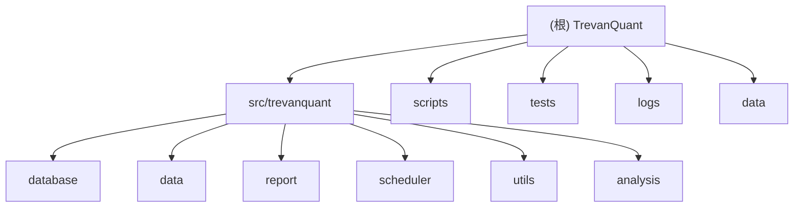

# TrevanQuant - A股量化复盘系统

## 项目愿景

TrevanQuant是一个基于akshare的A股量化复盘系统，专注于提供自动化、智能化的股票市场分析和报告生成功能。系统旨在为投资者提供每日盘后的市场分析、技术指标计算和投资建议，辅助用户做出更明智的投资决策。

## 架构总览

系统采用模块化设计，核心架构包括：

- **数据获取层**：基于akshare API获取实时和历史股票数据
- **数据存储层**：使用SQLite进行轻量级数据持久化
- **分析计算层**：技术指标计算和量化分析引擎
- **报告生成层**：自动生成HTML格式的分析报告
- **任务调度层**：基于schedule的自动化任务管理
- **通知服务层**：邮件报告推送服务

## ✨ 模块结构图



## 模块索引

| 模块路径 | 职责描述 | 核心文件 | 测试覆盖 |
|---------|---------|---------|---------|
| `src/trevanquant/database` | 数据模型定义、数据库连接管理、CRUD操作 | models.py, connection.py, crud.py | 部分覆盖 |
| `src/trevanquant/data` | 数据获取、技术指标计算、数据同步管理 | fetcher.py, indicators.py, sync.py | 基础测试 |
| `src/trevanquant/report` | 报告生成、邮件发送服务 | generator.py, email_service.py | 功能测试 |
| `src/trevanquant/scheduler` | 任务调度、系统运行管理 | task_scheduler.py, runner.py | 单元测试 |
| `src/trevanquant/utils` | 日志管理、配置管理、通用工具 | logger.py, config.py | 基础验证 |
| `src/trevanquant/analysis` | 量化分析策略（预留扩展） | *未实现* | 待开发 |

## 运行与开发

### 环境要求
- Python 3.11+
- uv（推荐）或 pip
- SQLite 3

### 快速启动
```bash
# 安装依赖
uv sync

# 配置邮件服务
cp .env.example .env
# 编辑 .env 文件设置邮件参数

# 初始化数据库
uv run python src/trevanquant/database/migrations.py init

# 启动系统
uv run python scripts/run_trevanquant.py start
```

### 开发模式
```bash
# 开发模式启动
uv run python scripts/run_trevanquant.py start --debug

# 执行单次任务
uv run python scripts/run_trevanquant.py run --task daily_report

# 查看系统状态
uv run python scripts/run_trevanquant.py status
```

## 测试策略

### 测试类型
1. **单元测试**：各模块核心功能测试
2. **集成测试**：模块间协作测试
3. **功能测试**：端到端业务流程测试
4. **性能测试**：数据处理性能验证

### 测试执行
```bash
# 运行所有测试
uv run pytest

# 测试覆盖率
uv run pytest --cov=src/trevanquant

# 特定模块测试
uv run python scripts/test_data_fetch.py
uv run python scripts/test_indicators.py
uv run python scripts/test_report.py
```

## 编码规范

### 代码风格
- 遵循PEP 8规范
- 使用Black进行代码格式化
- 使用isort进行导入排序
- 使用mypy进行类型检查

### 命名约定
- 类名：PascalCase
- 函数/变量名：snake_case
- 常量：UPPER_CASE
- 私有成员：前缀下划线

### 文档要求
- 所有公共API必须有docstring
- 使用Google风格的docstring
- 关键业务逻辑添加注释

## AI使用指引

### 开发辅助
- 代码生成：基于现有模式生成新功能
- Bug修复：辅助定位和修复问题
- 重构建议：代码结构优化建议
- 测试生成：自动生成单元测试

### 约束条件
- 不修改核心业务逻辑
- 保持现有架构模式
- 遵循项目编码规范
- 确保向后兼容性

### 优先级指导
1. **高优先级**：数据完整性和系统稳定性
2. **中优先级**：功能完善和性能优化
3. **低优先级**：UI美化和非核心功能

## 变更记录 (Changelog)

### 2025-11-21 - 初始化架构文档
- 创建项目根级CLAUDE.md
- 建立模块结构图和索引
- 定义开发规范和AI使用指引
- 初始化各模块CLAUDE.md文档

### 项目历史
- v0.1.0: 基础功能实现
  - 数据获取和存储
  - 技术指标计算
  - 报告生成和邮件发送
  - 任务调度系统

---

*本文档由AI辅助生成，最后更新时间：2025-11-21*